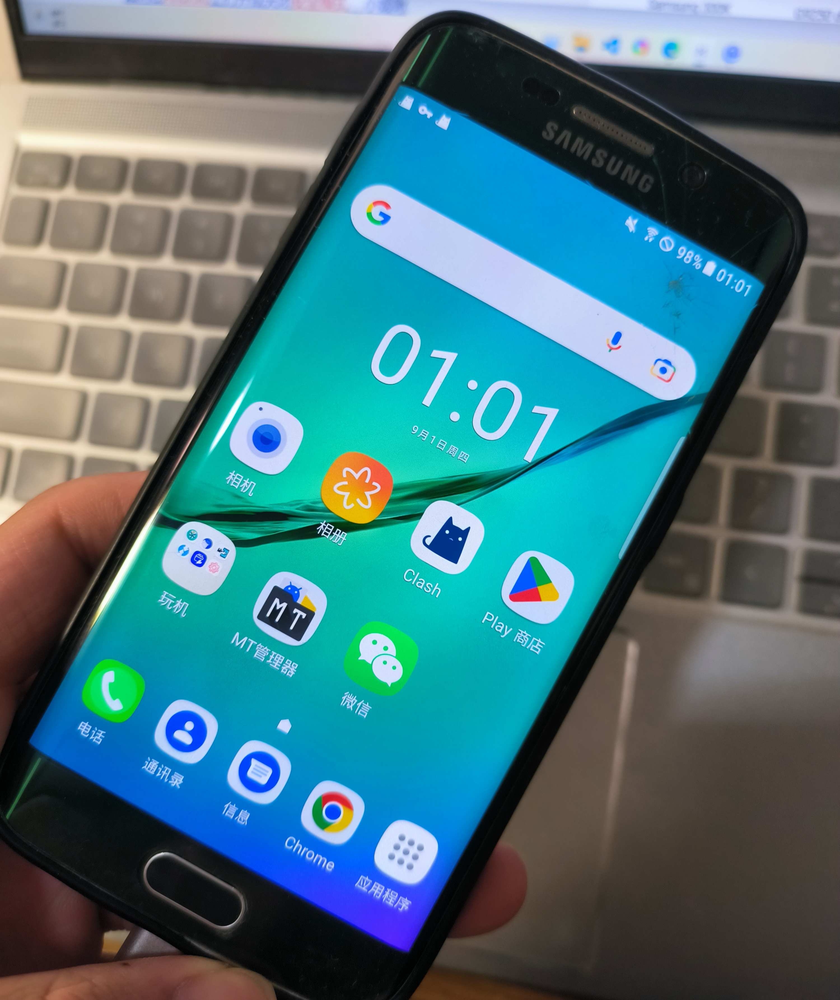
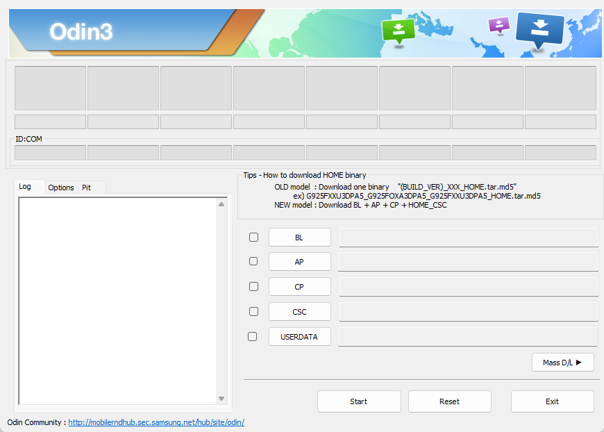
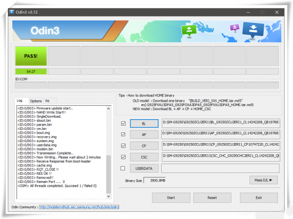
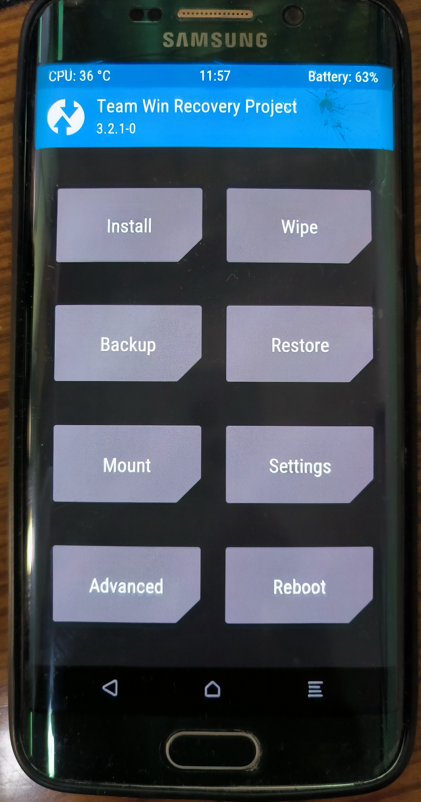

+++
title = "Samsung S6 Edge (SM-G9250) 刷机历程"
date = "2022-09-01T22:12:22+08:00"
draft = false
tags = ["Android"]
categories = ["教程"]
showHero = true
heroStyle = "big"
+++

## 前言

这台机子发布于 2015 年，采用猎户座 7420 处理器、5.1 英寸 2KSuperAMOLED 屏、三星第二代曲面屏设计。在当时算得上是绝对的旗舰机，尤其是绿色玻璃背板的设计在如今看来也绝不过时。

这两天刷机走了不少弯路，网上的资料不是过期就是版本有问题，故将过程和正确版本及所用文件总结于此。文中所有软件都会在文末提供链接下载。

正好最近比较闲，翻箱倒柜找出来，拿来刷个机玩一玩，让这台曾经的旗舰再度焕发光彩。

## 免责提示

**刷机有风险 数据价更高**

**因刷机导致故障作者不承担任何责任**

## 用例

Samsung Galaxy S6 Edge 国行（SM-G9250）

原厂系统已 OTA 升级到最新，搭载 Android 7.0

## 刷机目标

1. 用上谷歌套件

2. 换上第三方 Recovery

3. 获取 root 权限

## 说明

1. 国行 ROM 难以找到适配的谷歌套件，故先换用港版 ROM 再进行后续操作。

2. 一旦解锁 BootLoader，Knox 将会物理熔断，失去保修资格，导致 Knox 安全文件夹、Samsung Pay、三星健康无法使用！此操作不可逆，除换主板外无法恢复！

3. 本方案采用 Magisk-alpha 来实现 root 并启动 MagiskHide

   - 由于官方 ROM 内核过旧（<3.19），启用 zygisk (Magisk in Zygote)后会导致 root 丢失，解决方法唯有换用更新的自定义内核。[该问题](https://github.com/topjohnwu/Magisk/issues/5395)在 Magisk 的 Github 仓库被标记为 Wontfix Issue，本文不涉及解决方法。

   - 由于无法启用 zygisk，故无法使用 shamiko。因此使用 magisk-alpha 的 MagiskHide 功能做隐藏 root 的方法替代。

4. 了解 Android 启动流程有助于理解 Magisk 工作原理

5. 由于 Android 7.0 中 DST Root CA X3 根证书过期且未内置 ISRG Root X1 根证书，故部分采用 Let's Encrypt 证书的网站无法正常访问，通过 Clash 获取订阅也存在问题。如需修复请参照[我的另一篇文章](https://howerl.gitee.io/2022/08/Solving-the-problem-caused-by-the-expiration-root-certificate-on-old-Android-device/)。

6. 由于 LSPosed 不支持 Android 7.0，故采用 Xposed。为了与 Magisk 的 Systemless 特性相适应，需采用修改版的 XposedInstaller，可在此获取：https://github.com/Magisk-Modules-Repo/xposed

## 流程

### 一、解锁

- **使用 CROM 服务以解锁 BootLoader**，软件可在此获取：https://www.apkmirror.com/apk/samsung-electronics-co-ltd/crom-service/
- 在设置-账号中**退出手机上已登录的谷歌账号、三星账号以解锁账号锁**

### 二、使用 Odin 刷入港版 ROM

- 下载并安装最新版三星 USB 驱动（[https://samsungusbdriver.com](https://samsungusbdriver.com/)），安装结束后可能需要重启

- 下载港版 ROM，可通过[Galaxy Firmware](http://www.galaxyfirmware.com/)网站获取。进入网站后搜索 SM-G9250，选择最新的 TGY 地区包下载。

- 下载后在本地解压得到四个包，并启动 Odin3_v3.14.1 软件

  - Odin 旧版会出现刷机刷到一半进度条不动或加载 ROM 包时闪退的情况，v3.14.1 版本可在此下载：https://www.galaxyfirmware.com/dl/Odin3_v3.14.1.zip

- 将四个以 BL、AP、CP、CSC 开头的包文件分别拖入四个框中装载

- 将手机重启至 Odin 模式

  - 常规方式：先正常开机进入系统，在系统中长按电源键选重启，在开机第一屏出现前按住**音量下键+主页键+电源键**直到出现蓝绿色 Download 界面

  - 便捷方式：使用 Samsung 300K Tool，连接手机后点击左侧图标即可自动重启至 Odin 模式

- 用数据线将手机连接至电脑，确保弹出的一个通讯端口[ID:COM]端口显示为天蓝色，表示已检测到设备。

- 点击开始按钮，刷机途中请勿触碰手机。刷机完成后上方显示绿色的 PASS 标识，设备自动重启

### 三、使用 Odin 刷入 TWRP

这个步骤比较坑，TWRP 官网上的包均无法使用，要么第一屏无限重启，要么报错“Recovery Is Not Seandroid Enforcing”，也因此学会了如何救砖。最后在 XDA Forums 上找到修改后的 TWRP-3.2.1 成功刷入。

- 首先重启刚才打开的 Odin，将我已打包好的.tar 文件装载在 AP 处，其他栏均保持为空不要勾选，参考上方进入 Odin 模式并连接电脑
- 在点击开始后，保持长按**音量上键+主页键+电源键**以进入 Recovery，直到出现 TWRP 的界面**（包括刷机 PASS 后重启期间都请不要松手）**
- 此时，屏幕出现是否允许系统修改的提示，滑动以确认
- 进入 Wipe 菜单，选择 Format Data，并注意不要选择 Advanced Wipe，输入 yes 以确认清除系统数据
- 在完成界面不要点击 Reboot System，按屏幕内下方的虚拟主页键回到主页，进入 Reboot 菜单，选择 Recovery 以重启再进入 Recovery 模式
- 在此下载最新版 no-verity-opt-encrypt 用以禁止 dm 验证及强制加密：https://build.nethunter.com/android-tools/no-verity-opt-encrypt/
- 手机连接电脑后在 TWRP 界面下可以通过 MTP 将刚下载的.zip 文件传输至手机存储中，进入 Install 菜单，选择压缩包并滑动验证安装，然后 Reboot System
- 静候手机完成初始化后即完成 TWRP 的刷入

### 四、使用 TWRP 刷入 Magisk-alpha

为使用 MagiskHide 而换用 Magisk-alpha，刷入方法同 Magisk，包可在此获取：https://t.me/magiskalpha

由于三星 fastboot 的特殊性，Odin 下难以单独对 boot.img 进行修改，故采用 TWRP 卡刷 Magisk-alpha

- 下载 Magisk-alpha.apk 后，复制一份将文件拓展名修改为.zip 即为安装包，再复制一份修改为 uninstall.zip 即为卸载包，将三者放入手机存储中
- 重启手机，按住**音量上键+主页键+电源键**以进入 Recovery，进入 Install 菜单
- 找到并选择 Magisk-alpha.zip 滑动以验证安装，Reboot System 后安装 Magisk-alpha.apk，即完成了安装
- 设置中开启 MagiskHide，选择谷歌相关应用即可。

### 五、安装常用 Magisk 模块（非必要）

推荐安装：神仙自动救砖、Riru、Busybox for Android NDK、location_report_enabler

均已整理在下方提供的链接中，请遵照安装顺序。每次安装模块后均需重启！

1. 神仙自动救砖

2. Riru

3. Busybox for Android NDK

4. 其他

## 救砖

请参照流程图，相关包可解压 ROM 获取，然后再打包为 tar 文件

## 常用知识

- 长按**音量下键+电源键**以强制关机，可用于退出 Odin 模式
- 在开机第二屏长按**音量下键**可进入安全模式
- Magisk 与 Magisk-alpha 不共存，需先卸载（系统中卸载软件并卡刷 uninstall.zip）其一再安装（卡刷 zip 安装包文件并安装 apk）另一。
- 如遇 Magisk 的 Root 丢失情况，请先卸载（系统中卸载软件并卡刷 uninstall.zip）然后再次安装（卡刷 zip 安装包文件并安装 apk）。
- 在电脑上运行 Clash 并开启 Allow LAN 作为代理以供手机使用连接 GMS（系统初始化时需要用到）

## 文件下载

分享中包含以上教程所用的全部软件，以及一些其他的相关资料。

共有以下内容，按需下载：

- 港版 ROM、国行 ROM（覆盖包、升级包）、国行原厂 Recovery，可用于救砖
- ADB_Fastboot
- CROM 服务 apk 安装包
- 三星手机 USB 驱动
- Samsung 300K Tool
- Odin3_v3.14.1
- TWRP 修改版 3.2.1+no-verity-opt-encrypt-6.1
- Magisk-alpha 安装包+卸载包+apk+相关模块
- 修改版 XposedInstaller.apk+官方 Xposed 框架 v89 安装包+卸载包
- **三星内部 SM-G9250 维修手册**

百度网盘链接：https://pan.baidu.com/s/1UIgpG-8KxgUW_IGWW74bRw?pwd=kcz2

提取码：kcz2
