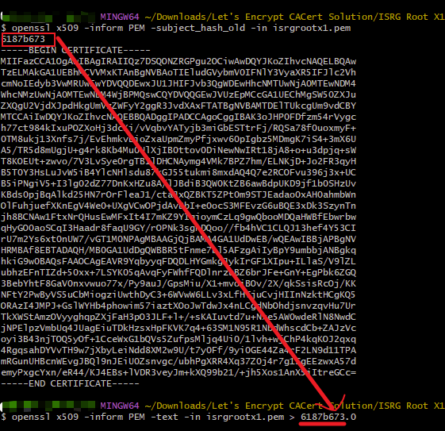
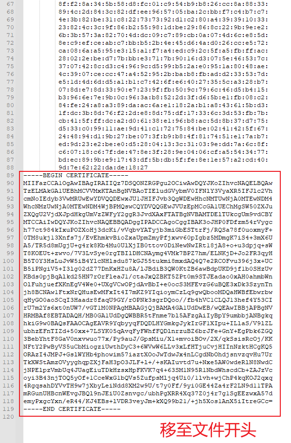
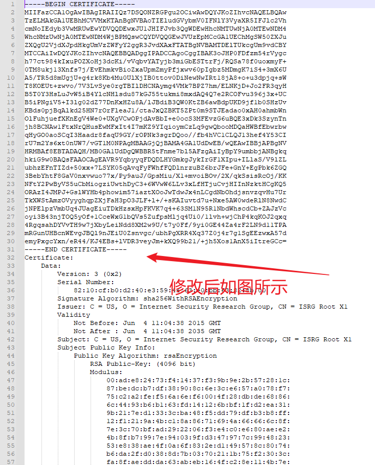

+++
title = "解决 Android 旧设备上因 Let's Encrypt 根证书过期导致的问题"
date = "2022-08-30"
draft = false
tags = ["Android"]
categories = ["解决方案"]
+++

**前几天捣鼓家里的旧手机（Android 7.0）装 Clash 后发现，通过 URL 导入配置来获取订阅时会出现证书过期（x509 certificate has expired or is not yet valid）的报错。**

于是开始 Troubleshoot：在电脑（Windows 11, Clash for Windows）和另一部手机（Android 12, Clash for Android）上能正常获取订阅更新，排除服务器问题，并确定是设备问题；使用最新版本的软件，问题仍然存在；手机当前时间正确；最终确定为**证书问题**。

在一番查找和排除后确定问题出在 DST Root CA X3 上，这个根证书于 2021 年 9 月 30 日过期，与报错的提示信息一致。**需禁用 DST Root CA X3 并导入新的根证书**。

---

利用 [SSLLabs](https://www.ssllabs.com/ssltest) 分析订阅链接所在的目标服务器，发现其采用 Let's Encrypt R3 证书，根证书为 ISRG Root X1，并通过 DST Root CA X3 交叉签名，但该证书过期后不受信任。

根据 Let's Encrypt 官网的[“证书兼容性”文档](https://letsencrypt.org/zh-cn/docs/certificate-compatibility/)显示，ISRG Root X1 在 Android >= 7.1.1 上为根证书并受到信任，因此 Android < 7.1.1 的旧设备在部分情况下将会不信任该证书。

详见 https://letsencrypt.org/docs/dst-root-ca-x3-expiration-september-2021/


解决方案呼之欲出。

通过 Let's Encrypt 官网的[“证书信任链”文档](https://letsencrypt.org/zh-cn/certificates/)获得到根证书 ISRG Root X1 和 ISRG Root X2 的自签名 .pem 格式，通过 openssl 转换为 `<hash>.0` 证书文件，并导入为 Android 系统证书。

## 如何转换？

Android 系统证书文件均保存于 `/system/etc/security/cacerts`，访问后发现文件名称均为 `<hash>.0`，经搜索得知文件名称为 _old-style (MD5) subject hash value_，而文件扩展名为 .0 以防止冲突（如有重复则为 .1，以此类推）

下面以 ISRG Root X1 证书为例进行转换：

环境：使用 Git Bash（已安装 openssl）

**1.** **利用 openssl 计算 hash 值后转换并重命名证书**

```bash
# 计算 isrgrootx1.pem 文件的 old-style (MD5) subject hash value
openssl x509 -inform PEM -subject_hash_old -in isrgrootx1.pem
# 对文件进行转换并重命名
openssl x509 -inform PEM -text -in isrgrootx1.pem > 6187b673.0
```



**2.** **对证书文件的结构进行修改**

找到底部的 Base64 编码（包含从 -----BEGIN CERTIFICATE----- 到 -----END CERTIFICATE----- 的部分）



并将该部分信息移至文件开头，保存。



这样就完成了文件的转换。

## 如何导入？

**必要条件：手机已经 Root 且有权限写入 /system**

**1.** 将 `<hash>.0` 文件复制至 `/system/etc/security/cacerts`

**2.** 给予文件 **644** 权限

**3.** 在手机设置中找到安全证书，禁用 DST Root CA X3

**4.** 重启手机

## 文件下载

在此提供已转换后的证书的百度网盘文件分享

链接：https://pan.baidu.com/s/14drO6wo2wNRsvSSgIhSa2w?pwd=m3q0

提取码：m3q0

· 原方案发表于 Github 仓库 Kr328/ClashForAndroid 的 [Issue](https://github.com/Kr328/ClashForAndroid/issues/1224#issuecomment-1225270156) 中，完善后发布于此处及微信公众平台。
